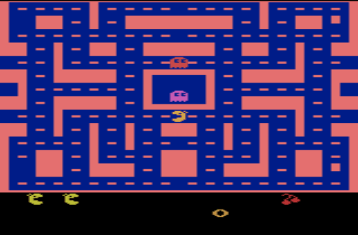

```markdown
# Deep Reinforcement Learning with MsPacman

This project implements a Deep Q-Network (DQN) using PyTorch to train an agent to play the game **Ms. Pac-Man** in the Gymnasium environment. The training involves processing visual observations and applying reinforcement learning techniques.

---

## Project Structure


├── sample.ipynb           # Main code file with training and evaluation
├── checkpoint.pth         # Saved model weights (generated after solving)
├── video.gif              # Visualized gameplay (generated after evaluation)
├── README.md              # Project documentation
└── requirements.txt       # Python dependencies
```

---

## Requirements

Ensure you have **Python 3.x** installed. To install the required dependencies, run:

```bash
pip install -r requirements.txt
```

---

## How to Run the Project

1. **Train the Agent:**
   - Run the script to train the agent in the MsPacman environment.
   
   ```python
   python main.py
   ```

2. **Visualize Training Progress:**
   - After training, a GIF file (`video.gif`) will be generated to visualize the agent's performance.

3. **Watch the Recorded Video:**
   - The code contains a function to display the gameplay recording inside a Jupyter Notebook.
   - If running in a Jupyter Notebook, use:

   ```python
   from main import show_video
   show_video()
   ```

---

## Project Components

### 1. **Neural Network Architecture**
The agent utilizes a Convolutional Neural Network (CNN) to process the visual input, with the following layers:

- 4 convolutional layers with batch normalization
- Fully connected layers for decision making
- ReLU activations for non-linearity

### 2. **Training Parameters**
- **Learning rate:** `5e-4`
- **Batch size:** `64`
- **Discount factor (Gamma):** `0.99`
- **Epsilon-greedy exploration:** Starts at `1.0`, decays to `0.01`
- **Episodes:** `2000`

### 3. **Preprocessing**
The frames are resized to `(128,128)` and converted to tensor format.

### 4. **Visualization**
A GIF file is generated to visualize the trained agent playing the game.

---

## Sample Output

Upon successful training, the console will output:

```
Episode 100	Average Score: 230.50
Episode 200	Average Score: 450.20
Environment solved in 300 episodes! Average Score: 520.00
```

---

## Dependencies

The following Python libraries are required:

- `gymnasium` – OpenAI Gym-compatible reinforcement learning environment.
- `gymnasium[atari, accept-rom-license]` – Atari games support.
- `gymnasium[box2d]` – Box2D physics engine for 2D games.
- `swig` – Simplified Wrapper Interface Generator.
- `ale-py` – Atari emulator.
- `torch` – Deep learning framework.
- `torchvision` – Image processing utilities.
- `Pillow` – Image handling.
- `opencv-python` – Image processing.
- `grpcio` – Remote communication.
- `imageio` – GIF creation and image handling.
- `ipython` – Display tools for Jupyter.

---

